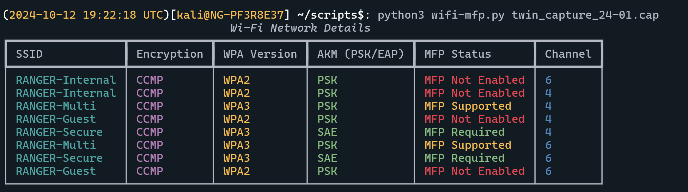
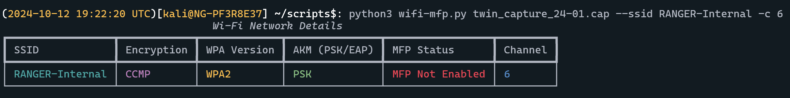
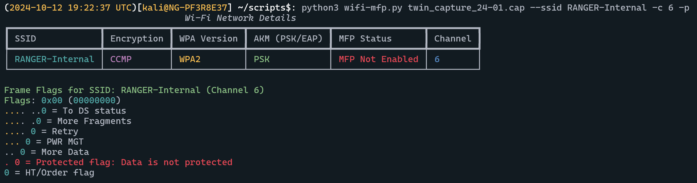
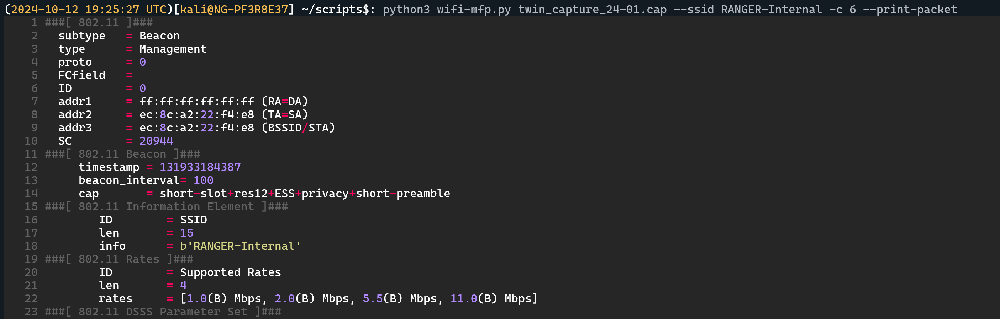

# Wifi-MFP 
This script is used to analyze a packet capture file quickly without the use of Wireshark to help determine the usage of Management Frame Protection (MFP). Additionally, other network details are printed to output as well.

# Usage

```sh
usage: wifi-mfp.py [-h] [-s SSID] [-c CHANNEL] [-p] [-P] [-D] pcap_file

Check MFP status in a PCAP file.

positional arguments:
  pcap_file             The PCAP file to analyze

options:
  -h, --help            show this help message and exit
  -s SSID, --ssid SSID  Specify an SSID to filter and print only that one
  -c CHANNEL, --channel CHANNEL
                        Specify a channel to filter and print only those SSIDs on the channel
  -p, --print-frames    Print frame flags for each SSID
  -P, --print-packet    Print the entire packet with syntax highlighting
  -D, --debug           Print debug statements for troubleshooting
```

# Screenshots

### Standard Usage


### Filter SSID


### Print Packet Frames


### Print Full Packet

